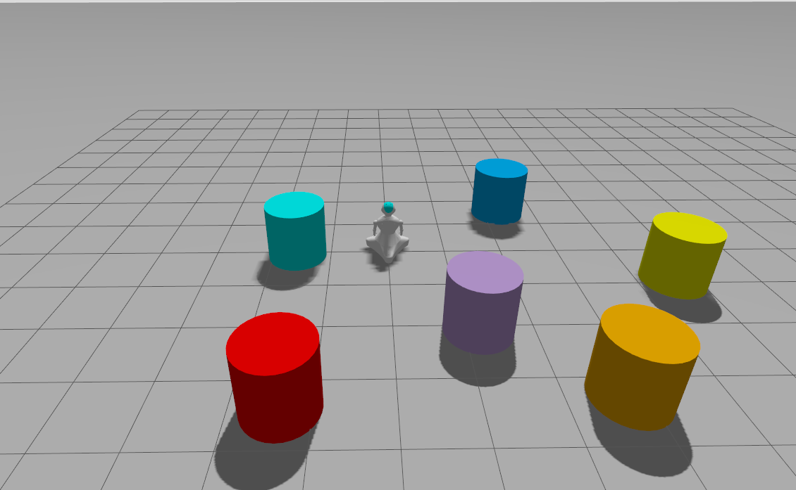

# semubot_gazebo

 

## **Overview**

Gazebo simulation for [SemuBot](https://github.com/SemuBot).

## **Table of Contents**
- [Installation](#installation)
- [Dependencies](#dependencies)
- [Building the Package](#building-the-package)
- [Launch Files](#launch-files)
- [License](#license)

---

## **Installation**

### **1. Clone the Repository**
```bash
cd ~/<YOUR_WORKSPACE_NAME_HERE>/src
git clone https://github.com/SemuBot/semubot_gazebo.git
```

## **Dependencies**
### **1. List of dependencies**
1.1. semubot_description
### **2. Install dependencies**
```bash
cd ~/<YOUR_WORKSPACE_NAME_HERE>
rosdep install --from-paths src --ignore-src -r -y
```

## **Building the package**
```bash
cd ~/<YOUR_WORKSPACE_NAME_HERE>
colcon build --symlink-install --packages-select semubot_gazebo
```

## **Launch files**
### **1. Source workspace**
```bash
source ~/<YOUR_WORKSPACE_NAME_HERE>/install/setup.bash
```
### **2. Available launch files**

Supported parameters:

| Name    | Description                            | Options                                          |
|---------|----------------------------------------|--------------------------------------------------|
| `world` | Specify world the robot is spawned in  | `colors.sdf`, `maze.sdf`, `empty.sdf` (default) |
| `x`, `y`, `z` | Specify the robot's spawn pose   | Number, `0` (default)                            |

#### 2.1. Gazebo launch

Spawns robot in the specified world

#### Load SemuBot in colors.sdf world at pose (1, 2, 0)
```bash
ros2 launch semubot_gazebo gazebo.launch.py world:=colors.sdf x:=1 y:=2
```



## **License**
This project is licensed under the Apache 2.0 license - see the [LICENSE](LICENSE) file for more information.
